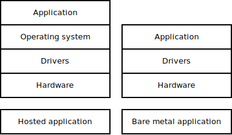
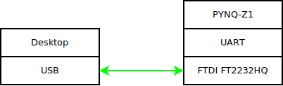

# Building and running the application on-device

Clone the code to your local computer using terminal.

`git clone https://github.com/RHamalainen/alien-shooter-template-rs.git`

This downloads the project directory `alien-shooter-template-rs` to your computer.
Project directory contains board configuration files, source code and build configuration files.

|Path|Description|Notes|
|---|---|---|
|`src/`|Rust source code|You have to edit these|
|`pynq/`|PYNQ-Z1 board configuration files||
|`Cargo.toml`|Rust library dependencies and package configuration||
|`.cargo/config.toml`|Rust build (compile and link) configurations||

Normally building and running a Rust application is usually as simple as invoking the main toolchain build command.
In this project we are cross-compiling from a desktop to another platform, in this case for PYNQ-Z1.
Thus we need to conform to the platform's requirements.
For instance we have to build the executable to use `ARMv7-A` instruction set architecture so that the processors (ARM Cortex-A9) can execute it.
To communicate with the hardware, we use functions defined in manufacturer's (Xilinx) board support package (BSP).
All in all, we have to provide the location of manufacturer's tools with the build command.

## Build the application

Switch to your project folder using terminal.

`cd alien-shooter-template-rs`

Install correct cross-compiler for this project.
PYNQ-Z1 contains dual-core ARM Cortex-A9, so the instruction set used is `armv7a`.
We also do not use an operating system.
We also use embedded application binary interface (EABI).
Thus the correct command is following.

`rustup target add armv7a-none-eabi`

We're going to need to provide the location of the manufacturer's tools as an environment variable. 
Scripts for doing this are provided.

Setting the environment variables is different on different types of terminals.

---
Using Windows command prompt is not recommended.

---

|Terminal|Command|
|---|---|
|Bash|`source ./scripts/tc219.env`|
|PowerShell|`. ./scripts/tc219.ps1`|

After the environment variables are set, we can execute `build`-command.

`cargo build`

This attempts to produce an executable file that we can run on PYNQ-Z1 ARM processors.

## Open an input-output interface to the board

To run the executable on the board, we have to program it to it.
To read textual output from the board, we have to open an interface to the board.
In this project, we use `USB-UART`-bridge between the desktop and the board.

Now we have to solve which COM port is used by the device.

1. Open `Windows Device Manager`.
2. Check what ports are listed under `Ports (COM & LPT)`.
3. Turn on PYNQ-Z1.
4. Check what `COM`-port appeared.
    - This port can vary.
    - It might be e.g. `COM5` or `COM6`.

Now we can open an application that displays the device's output in a textual format.

1. Open `PuTTY`.
    1. Select the following settings.
        * `connection type: serial`
        * `serial line: COM ???`
        * `speed: 115200`
    2. (Optional) You can save the configuration by typing a name into the `Saved Sessions`-field and pressing `Save`.
    3. Press `Open`.
2. If the connection was successful, you will see an empty PuTTY window.

## Program executable to device

We use Xilinx's tool `xsct` to program the executable and FPGA bitstream to the device.
You can find this program e.g. by typing `Xilinx Software Command Line Tool` to Windows Start Menu.

1. Start `xsct`.
2. Navigate to project folder using `cd` (and `dir`).
3. Run Xilinx's provided `Tickle`-script.
    - `source run_on_pynq.tcl`

If everything went fine, the executable should print text to the PuTTY-terminal.

## Summary

After making changes to the source code, build the program.

`cargo build`

Run the executable on the device (using `xsct`-tool).

`source run_on_pynq.tcl`
